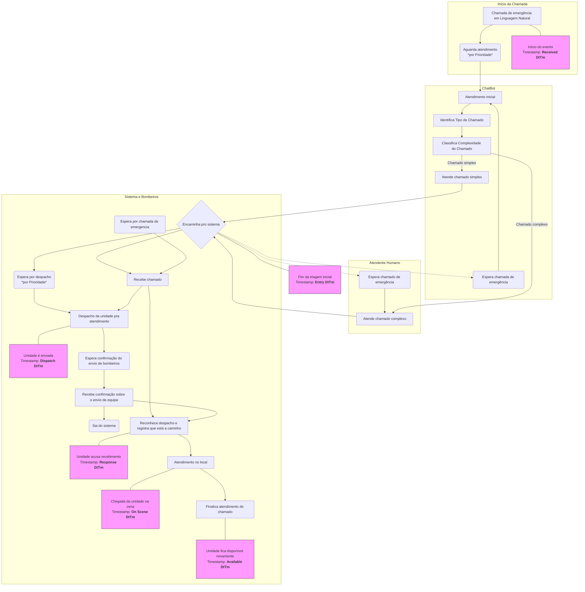

# SIMOIA - Simulação e Otimização com IA para Atendimento de Emergência

<p align="center">
  <font size="7">🚒</font> <font size="7">🤖</font>
</p>

<p align="center">
  
  
  
  
</p>

---

## 📖 Sobre o Projeto

**SIMOIA** é um projeto de simulação discreta que modela o fluxo de atendimento de chamadas de emergência de um corpo de bombeiros. O objetivo principal é analisar e quantificar o impacto da introdução de um **agente de IA híbrido** (chatbot) para realizar a triagem inicial das chamadas.

Utilizando dados reais do Departamento de Gerenciamento de Emergências de São Francisco, a simulação compara um cenário tradicional com um cenário otimizado pelo chatbot, avaliando métricas de desempenho como **tempo de espera na fila**, **tempo total no sistema** e **utilização de recursos** sob diferentes níveis de capacidade.

## 🏛️ Arquitetura da Solução

A solução foi construída sobre três pilares principais:

1.  **Análise Estatística e KDD:** Todo o projeto é orientado a dados. Usamos um notebook Jupyter (`kdd_analise_e_treinamento.ipynb`) para realizar um processo de KDD (Descoberta de Conhecimento em Dados), limpando os dados, definindo a "complexidade" de uma chamada e, o mais importante, usando o teste de Kolmogorov-Smirnov para encontrar as distribuições de probabilidade que melhor modelam os tempos do sistema real (tempo entre chegadas, tempo de serviço, etc.).

2.  **Agente de IA Híbrido:** O "cérebro" do sistema de triagem é um agente composto por duas partes:
    * **LLM (Ollama + `phi3`):** Um modelo de linguagem grande rodando localmente para interpretar a linguagem natural do usuário e extrair informações cruciais como `Call Type` e `Original Priority`.
    * **Modelo Classificador (scikit-learn):** Um modelo de Machine Learning (Regressão Logística) treinado com os dados históricos para tomar a decisão final e precisa de "Simples" vs. "Complexo".

3.  **Simulador de Eventos Discretos (SimPy):** O "mundo virtual" onde o sistema é testado. O simulador, escrito em Python com a biblioteca SimPy, gerencia as filas (com prioridade), a alocação de recursos (chatbot e unidades de bombeiros) e o fluxo de tempo, permitindo medir o desempenho do sistema de forma precisa.

## 🌊 Fluxo do Sistema - Diagrama de Atividades (ACD)

O diagrama abaixo ilustra o fluxo completo de uma chamada de emergência no sistema otimizado. Ele mostra desde o primeiro contato do cidadão até a finalização do atendimento pela unidade de bombeiros, com anotações que indicam qual *timestamp* do dataset corresponde a cada etapa do processo.



## 🚀 Como Executar o Projeto

Siga os passos abaixo para configurar e rodar a simulação.

### **Pré-requisitos**

* **Python 3.10+**
* **Git**
* **Ollama:** É necessário ter o Ollama instalado para rodar o modelo de linguagem localmente. Baixe em [ollama.com](https://ollama.com).

### **Instalação**

1.  **Clone o repositório:**
    ```bash
    git clone [https://github.com/seu-usuario/projeto-simoia.git](https://github.com/seu-usuario/projeto-simoia.git)
    cd projeto-simoia
    ```

2.  **Crie e ative um ambiente virtual:**
    ```bash
    # Criar
    python -m venv venv
    # Ativar (Linux/macOS)
    source venv/bin/activate
    # Ativar (Windows)
    .\venv\Scripts\activate
    ```

3.  **Instale as dependências:**
    ```bash
    pip install -r requirements.txt
    ```

4.  **Baixe o modelo de linguagem via Ollama:**
    ```bash
    ollama pull phi3
    ```
    *Certifique-se de que o aplicativo do Ollama está rodando em segundo plano.*

### **Execução**

Para rodar o ciclo completo de simulação (para 3, 5, 8 e 10 unidades), execute o script principal:

```bash
python main.py
```

Os resultados (tabela `.csv` e gráficos `.png`) serão salvos automaticamente na pasta `/results`.

## 🛠️ Tecnologias Utilizadas

* **Simulação:** SimPy
* **IA e NLP:** LangChain, Ollama, scikit-learn
* **Análise de Dados:** Pandas, NumPy, SciPy
* **Visualização:** Matplotlib, Seaborn

## 📂 Estrutura de Pastas

A estrutura do projeto foi organizada para garantir a modularidade e a clareza do código.

| Pasta / Arquivo | Propósito |
| :--- | :--- |
| **`data/`** | Contém os datasets. O dataset original, por ser muito grande, deve ser baixado **[neste link](https://data.sfgov.org/Public-Safety/Fire-Department-and-Emergency-Medical-Services-Dis/nuek-vuh3/explore/query/SELECT%0A%20%20%60call_number%60%2C%0A%20%20%60unit_id%60%2C%0A%20%20%60incident_number%60%2C%0A%20%20%60call_type%60%2C%0A%20%20%60call_date%60%2C%0A%20%20%60watch_date%60%2C%0A%20%20%60received_dttm%60%2C%0A%20%20%60entry_dttm%60%2C%0A%20%20%60dispatch_dttm%60%2C%0A%20%20%60response_dttm%60%2C%0A%20%20%60on_scene_dttm%60%2C%0A%20%20%60transport_dttm%60%2C%0A%20%20%60hospital_dttm%60%2C%0A%20%20%60call_final_disposition%60%2C%0A%20%20%60available_dttm%60%2C%0A%20%20%60address%60%2C%0A%20%20%60city%60%2C%0A%20%20%60zipcode_of_incident%60%2C%0A%20%20%60battalion%60%2C%0A%20%20%60station_area%60%2C%0A%20%20%60box%60%2C%0A%20%20%60original_priority%60%2C%0A%20%20%60priority%60%2C%0A%20%20%60final_priority%60%2C%0A%20%20%60als_unit%60%2C%0A%20%20%60call_type_group%60%2C%0A%20%20%60number_of_alarms%60%2C%0A%20%20%60unit_type%60%2C%0A%20%20%60unit_sequence_in_call_dispatch%60%2C%0A%20%20%60fire_prevention_district%60%2C%0A%20%20%60supervisor_district%60%2C%0A%20%20%60neighborhoods_analysis_boundaries%60%2C%0A%20%20%60rowid%60%2C%0A%20%20%60case_location%60%2C%0A%20%20%60data_as_of%60%2C%0A%20%20%60data_loaded_at%60%0AWHERE%0A%20%20%60call_date%60%0A%20%20%20%20BETWEEN%20%222025-01-01T21%3A58%3A18%22%20%3A%3A%20floating_timestamp%0A%20%20%20%20AND%20%222025-08-31T21%3A58%3A18%22%20%3A%3A%20floating_timestamp/page/filter)** e colocado na pasta `data/raw/`. |
| **`models/`** | Armazena os artefatos do modelo de ML treinado (pré-processador e classificador). |
| **`notebooks/`** | Contém o Jupyter Notebook com todo o processo de KDD e treinamento. |
| **`results/`** | Destino dos outputs da simulação (gráficos e tabelas). |
| **`src/`** | Coração do projeto, com todo o código-fonte modularizado. |
| ├── `agent/` | Módulo do agente de IA (chatbot, gerador de chamadas, prompts). |
| ├── `analysis/` | Módulo para a análise estatística de distribuições de probabilidade. |
| └── `simulation/`| Módulo do motor de simulação SimPy. |
| **`config.py`** | Arquivo de configurações centralizadas. |
| **`main.py`** | Ponto de entrada principal para executar a simulação. |
| **`requirements.txt`**| Lista de dependências Python do projeto. |

---
**Autores:** Luiz Jordany de Sousa Silva